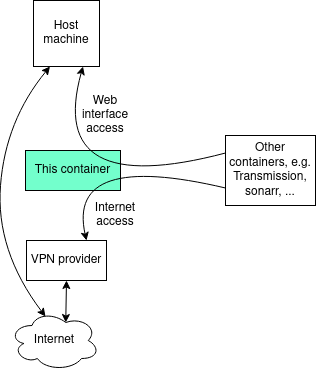

l2tp-vpn-client
===
[](https://github.com/r0hm1/l2tp-vpn-client/blob/master/LICENSE)

## Principle

A tiny Alpine 3.11 based docker image to quickly setup L2TP VPN client to encapsulate your internet traffic to other docker containers.



### What it does

This container will handle your connection to your VPN. It then can be used to handle internet access for other containers, routing internet traffic through the VPN and web interfaces to you.

### What it does not do
This container won't change anything to the way you access the internet from your **host machine**.

## Motivation
You don't want your ISP to know you hoard Linux ISOs but your VPN provider does not provide OpenVPN compliance.

All you need:

1. Your VPN server address
2. Pre Shared Key
3. Username
4. Password

## Quick start

### Docker run
```
    $ docker run --rm -it --privileged \
           --name l2tp-vpn-client\
           -v /lib/modules:/lib/modules:ro \
           -e VPN_SERVER_IPV4=000.000.000.000 \
           -e VPN_PSK= \
           -e VPN_USERNAME= \
           -e VPN_PASSWORD= \
           -e TZ=Europe/Paris \
           -e LAN=192.168.1.0/24 \
           -p 9091:9091/tcp\
           --net=vpn-network \
           r0hm1/l2tp-vpn-client
```
### Docker compose
```
version: '3'

networks:
  vpn-network:
    external: true
    name: vpn-network

services:
  l2tp-vpn-client:
    image: r0hm1/l2tp-vpn-client:latest
    container_name: l2tp-vpn-client
    hostname: l2tp-vpn-client
    privileged: true
    cap_add:
      - NET_ADMIN
    volumes:
      - /lib/modules:/lib/modules:ro
    environment:
      - VPN_SERVER_IPV4=000.000.000.000
      - VPN_PSK=
      - VPN_USERNAME=
      - VPN_PASSWORD=
      - TZ=Europe/Paris
      - LAN=192.168.1.0/24
    restart: unless-stopped
```

## Detailled setup

### Use case


### Prerequisites
You need a docker network with the following options. You can also use the default `bridge` network ; I like to keep VNP'd containers together. **Dont' use the `host` network as this container will mess with your routing table.**

+ name: whatever, *e.g.* `vpn-network`
+ driver: `bridge`
+ attachable: `true`
+ IPv4 subnet: *e.g.* `172.17.1.0/24`
+ IPv4 gateway: *e.g.* `172.17.1.1`

### Docker compose

```
version: '3'

networks:
  vpn-network: # The bridge network we created earlier
    external: true # Tells docker that the network is pre-existing
    name: vpn-network

services:
  l2tp-vpn-client:
    image: l2tp-vpn-client:latest
    container_name: l2tp-vpn-client
    privileged: true
    cap_add:
      - NET_ADMIN

    networks:
      - vpn-network # The bridge network we created earlier

    ports: # Open every needed port to access web interfaces
      - 9091:9091 # optional, default port for transmission
      - 9117:9117 # optional, default port for jackett
      - 7878:7878 # optional, default port for radarr
      - 8989:8989 # optional, default port for sonarr
      - 8686:8686 # optional, default port for lidarr

    volumes:
      - /lib/modules:/lib/modules:ro

    environment:
      - VPN_SERVER_IPV4=000.000.000.000
      - VPN_PSK=
      - VPN_USERNAME=
      - VPN_PASSWORD=
      - TZ=Europe/Paris
      - LAN=192.168.1.0/24
    restart: unless-stopped
```

Then create a service that will use the VPN:

```
version: '3'

volumes:
  transmission-vpn_config:
    name: transmission-vpn_config

services:
  transmission:
    image: ghcr.io/linuxserver/transmission:amd64-latest
    container_name: transmission
    network_mode: container:l2tp-vpn-client

    environment:
      - PUID=1000
      - PGID=100
      - TZ=Europe/Paris
      - TRANSMISSION_WEB_HOME=/combustion-release/ #optional

    volumes:
      - transmission-vpn_config:/config
      - /srv/dev-disk-by-uuid-000/torrent/download:/downloads
      - /srv/dev-disk-by-uuid-000/torrent/watch:/watch
    restart: unless-stopped
```

### Environment

| Variable          | Use            | Optional?  |
| ----------------- |:-------------- | :-----|
| `VPN_SERVER_IPV4` | The IP address (not the server name) of the VPN server you want to connect to. Given by your VPN supplier. | Mandatory |
| `VPN_PSK`         | The Pre Shared Key. Given by your VPN supplier. | Mandatory |
| `VPN_USERNAME`    | The username you used to sign up to your VPN supplier. | Mandatory |
| `VPN_PASSWORD`    | The password you used to sign up to your VPN supplier. | Mandatory |
| `TZ`              | The timezone you are in. Used in the logs.  | Optional |
| `LAN`             | The network from which you will be accessing the web interfaces. | Mandatory |


## References
* [https://hub.docker.com/r/ubergarm/l2tp-ipsec-vpn-client/](https://hub.docker.com/r/ubergarm/l2tp-ipsec-vpn-client/)
* [https://hub.docker.com/r/haugene/transmission-openvpn/](https://hub.docker.com/r/haugene/transmission-openvpn/)
